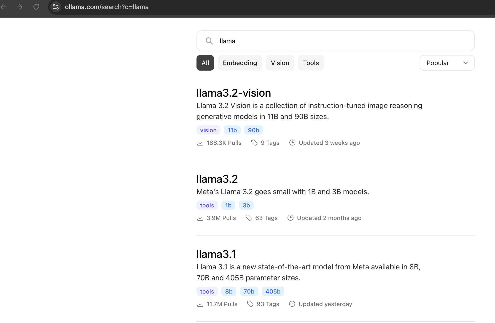
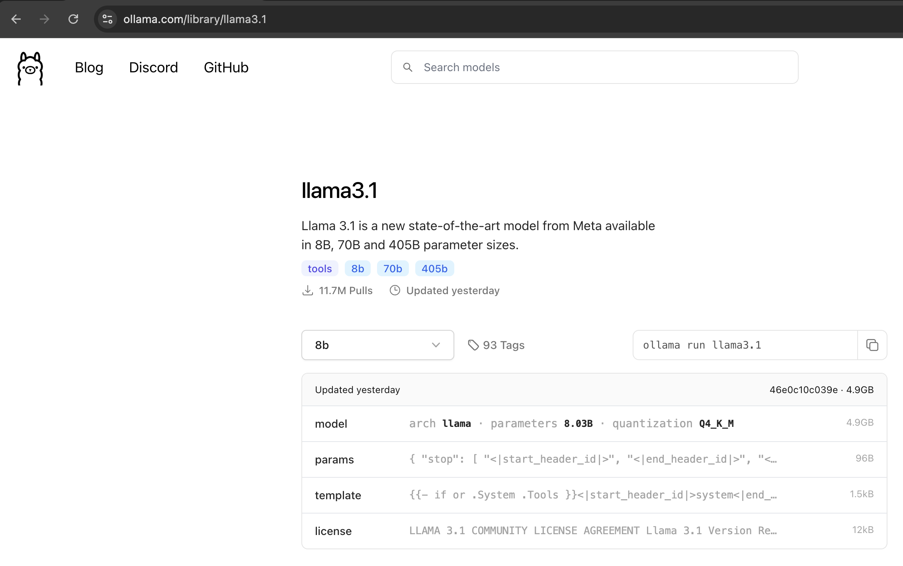
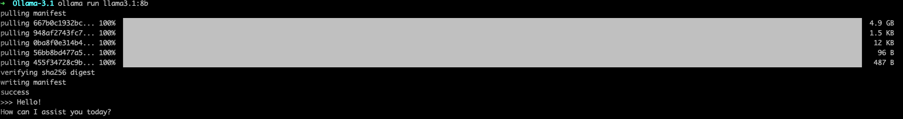
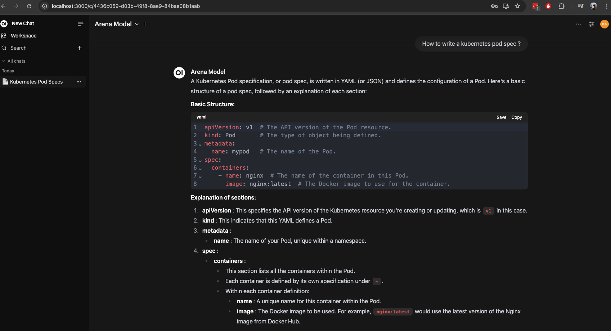

# Create a GPT locally using Ollama

This guide walks you through the steps to pull, install, and set up **Llama 3.2** on macOS, ensuring a seamless configuration process so that you can run a chatgpt like interface locally.

---

## **Table of Contents**

1. [System Requirements](#system-requirements)
2. [Setup Instructions](#setup-instructions)
   - [Search model](#1-search-model)
   - [Check parameter sizes](#2-check-parameter-sizes)
3. [Run Llama](#3run-llama)
4. [Setup Open WebUI interface](#setup-open-webui-interface)
5. [Uninstallation](#uninstallation)

---

## **System Requirements**

Ensure the following requirements are met before installation:

- **Operating System**: macOS 11.0 (Big Sur) or later
- **Hardware**:
  - Minimum: 8GB RAM, 10GB free disk space
  - Recommended: 16GB RAM for optimal performance
- **Software**:
  - Python 3.9 or later
  - Git
  - Docker
  - Optional: Virtual environment tools (e.g., `venv`)
- **Internet Access**: Required for downloading dependencies and model files

---

## **Setup Instructions**

### **1. Search model**

1. Open the browser.
2. Navigate to the official Ollama website: [https://ollama.com/search?q=llama](https://ollama.com/search?q=llama).



### **2. Check parameter sizes**

1. Search for llama3.1
2. Check the parameter sizes, such as 8b, 70b, 405b.
3. Choose the smallest one for a quick install.


### **3. Run llama**

Run the command to pull model llama3.1 with parameter size of 8.

```ollama run llama3.1:8b```



Once the it starts up, you can now ask questions to the local llama model.

### **4. Setup Open WebUI interface**
To interact with the model, we can use Open Web UI which provides a number of features such as SSO integrations, chat history, administration panel, rbac.

Need to have docker installed for the open web ui setup.

```
docker run -d -p 3000:8080 --add-host=host.docker.internal:host-gateway -v open-webui:/app/backend/data --name open-webui --restart always ghcr.io/open-webui/open-webui:main
```

Access the open web ui dashboard using the URL on your browser.

```
http://localhost:3000
```

It will prompt you for setting up a password initially. Once done, you are now ready to ask the questions.




### **5. Uninstallation**

Run the command to delete model llama3.1.

```ollama rm llama3.1:8b```
